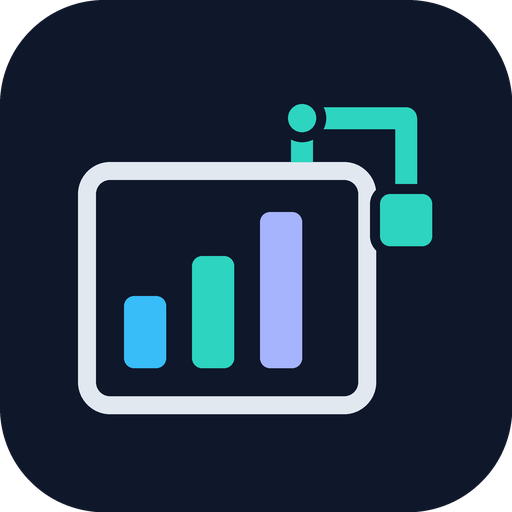

# Looker Report Helper



Design and edit **Google Looker Studio reports with natural-language instructions**, using your Chrome session and an MCP-capable assistant.

This repository includes a Codex plugin, a reusable skill, Claude Code and OpenCode configuration examples, and a practical guide based on controls operated in a real report. [Microsoft Playwright MCP](https://github.com/microsoft/playwright-mcp) provides the browser engine; this project provides the Looker workflow and instructions. It is not an official Google product or a report-editing API.

**Version 0.4 includes 13 executable tools:** create/configure a chart in one workflow, discover and switch sources, search fields, set titles and sorting, position components and apply colors. The agent supplies structured intent; the server performs the supported UI sequences and checks their controls. Checkpoints help retries reuse an inserted chart. A compact mode reduces the exposed tool set for agents with limited context. See [setup and examples](docs/actions.md).

This reduces the UI work the model must plan. It does not guarantee identical results across models: the agent still interprets the request, chooses meaningful fields and verifies analytical results. Big Pickle and other smaller models have not been benchmarked. See [measured validation](docs/validation.md).

## Quick start

1. Install Node.js 18+, Python 3.11+, Chrome and [Playwright Extension](https://github.com/microsoft/playwright-mcp#browser-extension). Python runs the action server; the browser-only fallback does not need it.
2. Open a report you can edit in Chrome.
3. Follow the [action-server setup](docs/actions.md) for your client. The [installation guide](docs/installation.md) also documents the browser-only fallback.
4. Ask: “Read `skills/design-looker-report/SKILL.md`, connect to the Looker tab I select, and inventory its charts before editing.”
5. Select the tab when the extension prompts you.

**“No clients are currently connected”** means the assistant has not connected an MCP server. Installing the browser extension alone does not start that connection.

## Documentation

- [Installation: Codex, Claude Code and OpenCode](docs/installation.md)
- [Executable actions: tools, selectors, examples and limitations](docs/actions.md)
- [Short recipes for agents: sources, complete charts and colors](skills/design-looker-report/references/action-recipes.md)
- [Practical Looker Studio editing guide](skills/design-looker-report/references/looker-studio-guide.md)
- [Troubleshooting and known limitations](docs/troubleshooting.md)
- [Example prompts](examples/prompts.md)
- [Report brief template](examples/report-brief.example.md)
- [Contributing and publishing](CONTRIBUTING.md)
- [Validation status](docs/validation.md)

## Capabilities

The executable tools support six chart types, existing field slots, exact placement, source selection and chart colors. The skill and browser tools also guide operations such as text boxes, number formats, filters and heatmaps; these do not yet have deterministic actions. Changes to controls, sessions or permissions may require intervention.

The original integration edited a real report through Codex on Windows. Other clients use their documented MCP formats; a valid configuration does not prove that every Looker control works from every client. See the validation record for measured results.

## Development

```sh
python scripts/check.py
python -m unittest discover -s tests -v
python scripts/smoke_test.py
python scripts/smoke_actions.py
python scripts/smoke_actions.py --compact
```

The smoke commands download/start the pinned Playwright MCP version and check available tools without editing reports. `scripts/smoke_test.py --browser-test` tests a click and drag in an isolated local page; `--connect` checks the extension and may display its tab picker. Do not run multiple assistants editing the same report concurrently.

The public plugin configuration uses `npx`. On Windows, use the client-specific configuration in the installation guide. Keep report exports, private screenshots and credentials outside this repository.

Original project files are MIT-licensed. Playwright MCP is an external dependency under its own Apache-2.0 license; its implementation is not redistributed here.
